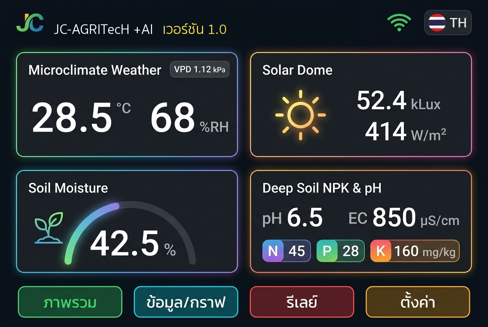
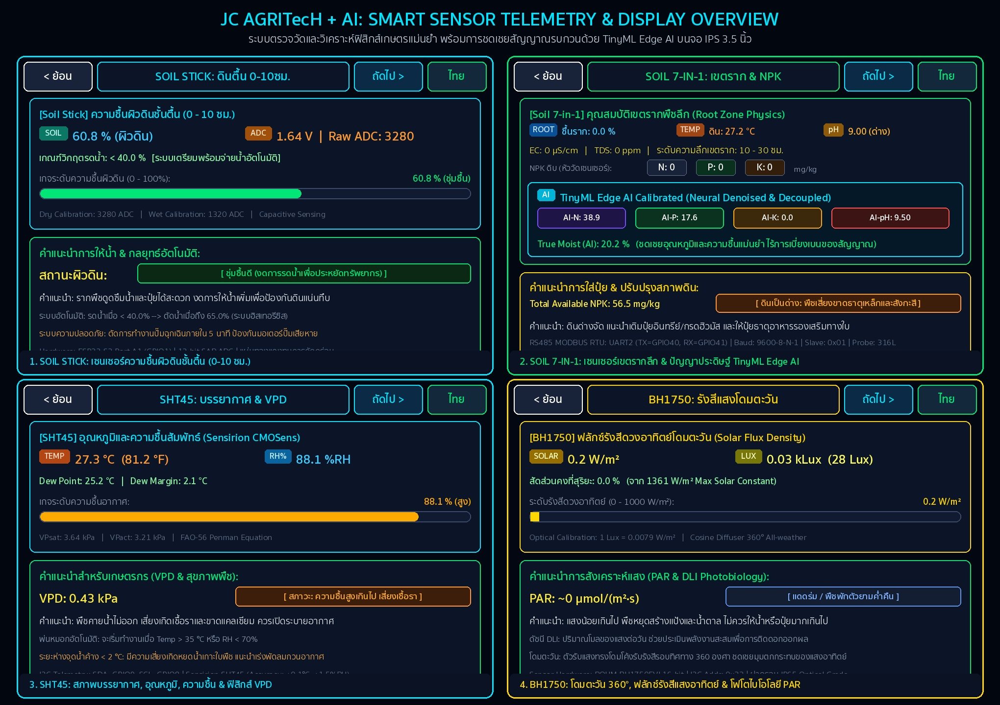
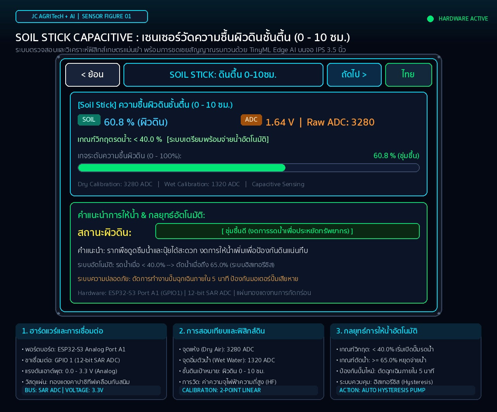
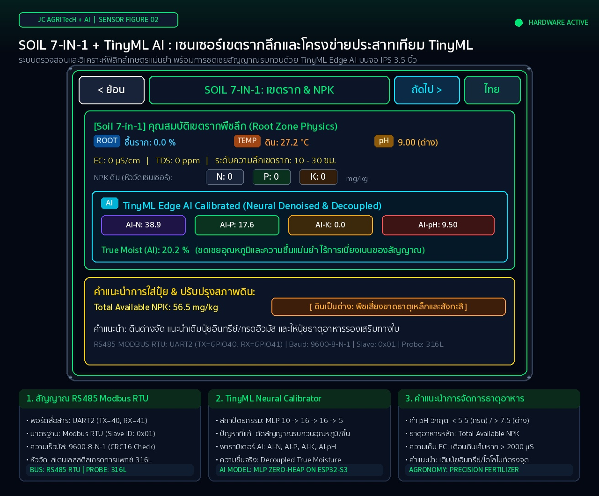
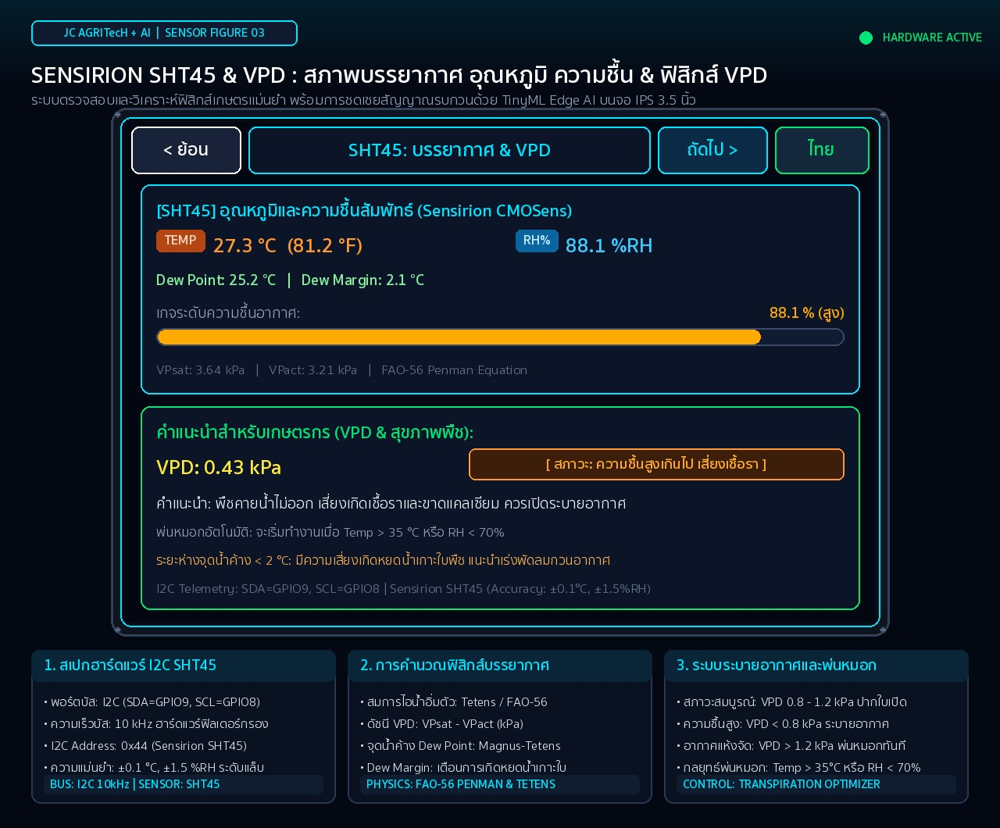
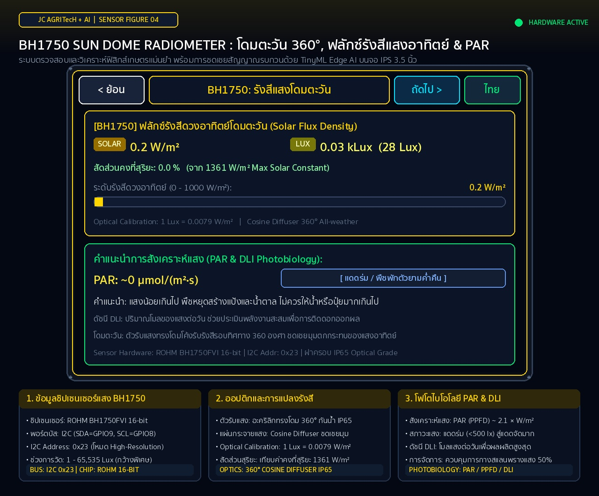

# JC -AGRITecH + AI Version 1.0 (JC-AGRITecH2026)
### คู่มือและพิมพ์เขียวระบบฟาร์มอัจฉริยะด้วยปัญญาประดิษฐ์และการเรียนรู้เชิงลึก
**จากสมองกลฝังตัวสู่การพยากรณ์แปลงปลูกด้วย Deep Learning**

> **ผู้วิจัยและผู้พัฒนาระบบ:**  
> **ผศ.ดร.จิรภัทร จันทมาลี** (สาขาวิชาจุลชีววิทยา) & **ผศ.ดร.ชีวะ ทัศนา** (สาขาวิชาฟิสิกส์)  
> คณะวิทยาศาสตร์และเทคโนโลยี มหาวิทยาลัยราชภัฏรำไพพรรณี

---





### 🖥️ ภาพแสดงรายละเอียดหน้าจอเซนเซอร์เดี่ยวทั้ง 4 สถานี (Dedicated Sensor Telemetry Figures)

| 1. เซนเซอร์ผิวดินชั้นตื้น Soil Stick (0-10 ซม.) | 2. เซนเซอร์เขตรากลึก Soil 7-in-1 & TinyML AI |
| :---: | :---: |
| [](figure_sensor_01_soil_stick.jpg) | [](figure_sensor_02_soil_7in1.jpg) |
| **3. สภาพบรรยากาศ, ความชื้น & ฟิสิกส์ VPD (SHT45)** | **4. โดมตะวัน 360°, ฟลักซ์รังสีแสง & PAR (BH1750)** |
| [](figure_sensor_03_sht45.jpg) | [](figure_sensor_04_bh1750.jpg) |

## 📌 ภาพรวมโครงการ (Project Overview)
**JC -AGRITecH + AI เวอร์ชัน 1.0** คือแพลตฟอร์มเกษตรอัจฉริยะแบบฟูลสแตก (Full-Stack Smart Agriculture Platform) ระดับอุตสาหกรรมที่ผสาน **วิศวกรรมสมองกลฝังตัว (Embedded Engineering)**, **ปัญญาประดิษฐ์ระดับขอบโครงข่าย (TinyML Edge AI)**, **การเรียนรู้เชิงลึกพยากรณ์อนุกรมเวลา (Cloud Deep Learning Time-Series Forecaster)** และ **ตำราวิชาการระดับ Masterclass** เข้าด้วยกันอย่างสมบูรณ์แบบ

---

## 🏗️ โครงสร้างสถาปัตยกรรมไดเรกทอรี (Repository Structure)

```
JC-AGRITecH2026/
├── gravity/                     # เฟิร์มแวร์สมองกลฝังตัว C++ (PlatformIO)
│   ├── platformio.ini           # คอนฟิกบอร์ด ATD3.5-S3 (ESP32-S3 8MB Flash/2MB PSRAM)
│   ├── include/                 # Header Files (PinConfigs, SoilNeuralCalibrator, Display)
│   ├── src/                     # Source Files (AgriSensors, CloudSync, DisplayManager)
│   ├── WIRING_DIAGRAM.md        # คู่มือการต่อสายไฟของเซนเซอร์จริง
│   └── README.md                # คู่มือเฟิร์มแวร์เฉพาะโมดูล
│
├── server/                      # ระบบแบ็กเอนด์ ฐานข้อมูล และแดชบอร์ด
│   ├── main_api.py              # FastAPI Cloud Telemetry Service (REST API)
│   ├── database.py              # SQLAlchemy Schema & Auto-Migration (30 ฟิลด์)
│   ├── dashboard_app.py         # Streamlit Agricultural Cockpit (Virtual Replica + AI Lab)
│   ├── serial_bridge.py         # ไพพ์ไลน์รับส่งข้อมูลจากพอร์ตอนุกรมอัตโนมัติ
│   ├── requirements.txt         # รายการแพ็กเกจ Python สำหรับรันระบบ
│   └── agri_telemetry.db        # ฐานข้อมูลตัวอย่าง Telemetry
│
├── scripts/                     # สคริปต์แบบจำลองฟิสิกส์เคมีดินและฝึกสอน AI
│   └── train_soil_calibrator.py # จำลอง Hilhorst/Rhoades/Nernst และส่งออก C++ Header
│
├── latex_book/                  # เล่มตำราวิชาการและคู่มือฉบับสมบูรณ์ (78 หน้า)
│   ├── main.tex                 # รหัสต้นฉบับหลัก XeLaTeX
│   ├── main.pdf                 # เล่มตำราฉบับสมบูรณ์พร้อมพิมพ์/เผยแพร่ (Masterclass)
│   ├── chapters/                # บทที่ 1 - 5 พร้อม ภาคผนวก ก และ ภาคผนวก ข
│   ├── styles/rbru_style.sty    # สไตล์ชีตมาตรฐาน RBRU & Springer/MIT Press
│   └── figures/                 # แผนผังเวกเตอร์และรูปภาพประกอบตำรา
│
├── MANUAL_AND_PROMPT_BOOK.md    # สมุดบันทึกวิศวกรรมและสารบบพรอมพ์บริบท (Prompts 1-39)
├── smart_farm_ui_overview.jpg   # ภาพรวมหน้าจอควบคุมและฮาร์ดแวร์จริง
├── splash_screen_ai_concept.jpg # ภาพคอนเซปต์หน้าจอบูตสกรีน 3D
└── splash_screen_ai_concept_v2.jpg
```

---

## ⚡ คุณสมบัติทางเทคโนโลยีที่สำคัญ (Key Technical Highlights)

### 1. 🔬 TinyML On-Device Neural Calibrator (ESP32-S3)
* ทำงานบนชิปไมโครคอนโทรลเลอร์ ESP32-S3 Xtensa FPU @ 240 MHz
* สถาปัตยกรรม Multi-Layer Perceptron ($10 \to 16 \to 16 \to 5$)
* ชดเชย **Cross-Sensitivity** และ **Thermal Drift** ของเซนเซอร์ NPK, pH, EC และ Moisture
* ใช้หน่วยความจำแฟลชคงที่ (< 2.2 KB) และประมวลผลแบบ **Zero Dynamic Memory Allocation** (< 0.12 ms)

### 2. 📊 High-Performance Cloud Telemetry & Cockpit
* **FastAPI:** ให้บริการ RESTful API รองรับการนำเข้าข้อมูลโทรมาตรแบบอะซิงโครนัส
* **SQLite / SQLAlchemy:** ระบบจัดเก็บข้อมูล 30 มิติ พร้อมระบบปรับสคีมาอัตโนมัติ (Auto-Migration)
* **Streamlit Agricultural Cockpit:** หน้าปัดควบคุมแปลงปลูก 5 หน้า พร้อมกราฟิกจำลองหน้าจอ LCD 3.5 นิ้ว และระบบพยากรณ์ Time-Series (LSTM / Ridge)

### 3. 📖 คู่มือและตำราวิชาการระดับ Masterclass (LaTeX)
* จัดทำตามระเบียบมหาวิทยาลัยราชภัฏรำไพพรรณี (RBRU) ผสมผสานความประณีตระดับ Springer / Cambridge University Press
* บรรจุสมการฟิสิกส์เคมีดิน, แผนผังวงจร, ผลการทดลอง, สารบบพรอมพ์บริบท (ภาคผนวก ก) และพิมพ์เขียวซอร์สโค้ดระบบครบวงจร (ภาคผนวก ข)

---

## 🚀 การเริ่มต้นใช้งานเบื้องต้น (Quick Start)

### 1. การติดตั้งและแฟลชเฟิร์มแวร์ ESP32-S3
```bash
cd gravity
pio run -e esp32-s3-atd35 -t upload
```

### 2. การรันระบบเซิร์ฟเวอร์และแดชบอร์ด
```bash
cd server
python3 -m venv venv
source venv/bin/activate
pip install -r requirements.txt

# รัน FastAPI และ Streamlit Dashboard
uvicorn main_api:app --host 0.0.0.0 --port 8000 &
streamlit run dashboard_app.py --server.port 8501 &
python serial_bridge.py
```

### 3. การคอมไพล์เล่มตำราวิชาการ XeLaTeX
```bash
cd latex_book
xelatex -interaction=nonstopmode main.tex
makeindex main.idx
xelatex -interaction=nonstopmode main.tex
```

---
*ลิขสิทธิ์และทรัพย์สินทางปัญญา © 2026 คณะวิทยาศาสตร์และเทคโนโลยี มหาวิทยาลัยราชภัฏรำไพพรรณี*
