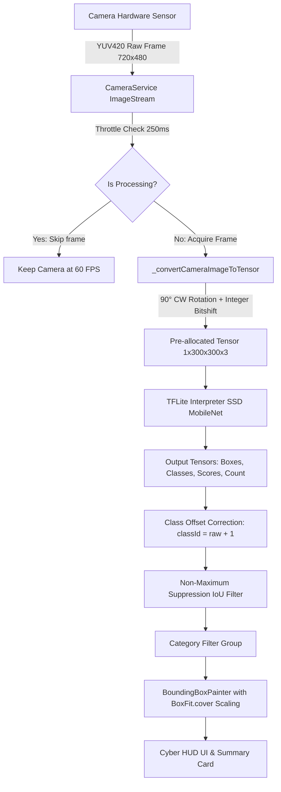

# คู่มือการใช้งานและเอกสารสถาปัตยกรรมระบบ (User & Technical Manual)
## ระบบปัญญาประดิษฐ์ตรวจจับวัตถุหลายชนิดแบบเรียลไทม์ (Real-Time Multi-Object AI Detector)
**เวอร์ชัน:** 1.0.0 (Production Release)  
**คณะผู้วิจัยและพัฒนา:** ผศ.ดร.ชีวะ ทัศนา และคณะ | มหาวิทยาลัยราชภัฏรำไพพรรณี (RBRU)

---

## สารบัญ (Table of Contents)
1. [ภาพรวมของระบบ (System Overview)](#1-ภาพรวมของระบบ-system-overview)
2. [สถาปัตยกรรมทางเทคนิค (System Architecture)](#2-สถาปัตยกรรมทางเทคนิค-system-architecture)
   - [2.1 แผนภาพการไหลของข้อมูล (Data Flow Pipeline)](#21-แผนภาพการไหลของข้อมูล-data-flow-pipeline)
   - [2.2 การประมวลผลสัญญาณภาพและ Fast Integer Bitshift](#22-การประมวลผลสัญญาณภาพและ-fast-integer-bitshift)
   - [2.3 การจัดสัดส่วนพิกัดและการหมุนภาพ (Coordinate & Rotation Alignment)](#23-การจัดสัดส่วนพิกัดและการหมุนภาพ-coordinate--rotation-alignment)
   - [2.4 การถอดรหัสคลาสวัตถุและแผนผัง 1-Based COCO Mapping](#24-การถอดรหัสคลาสวัตถุและแผนผัง-1-based-coco-mapping)
3. [คู่มือการใช้งานสำหรับผู้ใช้ (User Guide)](#3-คู่มือการใช้งานสำหรับผู้ใช้-user-guide)
   - [3.1 การเริ่มต้นเปิดแอปพลิเคชันและสิทธิ์การเข้าถึง](#31-การเริ่มต้นเปิดแอปพลิเคชันและสิทธิ์การเข้าถึง)
   - [3.2 องค์ประกอบบนหน้าจอแสดงผล Cyber HUD](#32-องค์ประกอบบนหน้าจอแสดงผล-cyber-hud)
   - [3.3 การกรองหมวดหมู่วัตถุ (Category Filtering)](#33-การกรองหมวดหมู่วัตถุ-category-filtering)
   - [3.4 การปรับแต่งเกณฑ์ตรวจจับ (Detection Settings)](#34-การปรับแต่งเกณฑ์ตรวจจับ-detection-settings)
   - [3.5 การถ่ายภาพนิ่งและการวิเคราะห์จากคลังภาพ (Snapshot & Gallery Analysis)](#35-การถ่ายภาพนิ่งและการวิเคราะห์จากคลังภาพ-snapshot--gallery-analysis)
4. [คู่มือสำหรับนักพัฒนา (Developer Guide)](#4-คู่มือสำหรับนักพัฒนา-developer-guide)
   - [4.1 โครงสร้างโฟลเดอร์และไฟล์สำคัญ](#41-โครงสร้างโฟลเดอร์และไฟล์สำคัญ)
   - [4.2 การติดตั้งและเตรียมสภาพแวดล้อม (Prerequisites & Setup)](#42-การติดตั้งและเตรียมสภาพแวดล้อม-prerequisites--setup)
   - [4.3 คำสั่งทดสอบระบบ (Automated Tests)](#43-คำสั่งทดสอบระบบ-automated-tests)
   - [4.4 การ Build และ Deploy ลงสมาร์ทโฟน Android](#44-การ-build-และ-deploy-ลงสมาร์ทโฟน-android)
5. [การแก้ปัญหาเบื้องต้น (Troubleshooting Guide)](#5-การแก้ปัญหาเบื้องต้น-troubleshooting-guide)

---

## 1. ภาพรวมของระบบ (System Overview)

**Multi-Object AI Detector** เป็นแอปพลิเคชันสมาร์ทโฟนที่พัฒนาด้วยเฟรมเวิร์ก **Flutter (Dart)** ผสานการทำงานร่วมกับเอนจิน **TensorFlow Lite (TFLite)** บนอุปกรณ์ประมวลผลส่วนปลาย (Edge AI / On-Device Computing) 

### วัตถุประสงค์หลัก
1. สามารถตรวจจับ ระบุพิกัดตำแหน่ง (Bounding Box) และจำแนกประเภทของวัตถุจริงได้พร้อมกันหลายชนิด (**Real-Time Multi-Object Detection**) โดยไม่ต้องพึ่งพาอินเทอร์เน็ตหรือส่งข้อมูลขึ้น Cloud
2. รองรับวัตถุมาตรฐานสากล **COCO Dataset** จำนวน 80–90 ชนิด พร้อมแสดงชื่อวัตถุ 2 ภาษา (ไทย-อังกฤษ)
3. แสดงผลค่าความเชื่อมั่น (**Confidence Score %**) พร้อมแถบสีจำแนกระดับความแม่นยำ
4. อินเทอร์เฟซผู้ใช้สไตล์ **Cyberpunk AI Vision HUD** สีสันคมชัดแบบ High-Contrast เพื่อให้อ่านค่าได้ชัดเจนทั้งในร่มและกลางแจ้ง

---

## 2. สถาปัตยกรรมทางเทคนิค (System Architecture)

### 2.1 แผนภาพการไหลของข้อมูล (Data Flow Pipeline)



---

### 2.2 การประมวลผลสัญญาณภาพและ Fast Integer Bitshift

เซนเซอร์กล้อง Android ส่วนใหญ่ส่งภาพดิบมาในรูปแบบ **YUV420_888** ซึ่งประกอบด้วย:
- **Y Plane (Luminance):** ค่าความสว่างระดับสีเทา
- **U Plane (Chrominance Blue):** ข้อมูลสัญญาณสีน้ำเงิน
- **V Plane (Chrominance Red):** ข้อมูลสัญญาณสีแดง

เดิมการแปลงค่าสีแบบ Floating-Point คูณและหาร `round().clamp()` ซ้อนลูป $300 \times 300 = 90,000$ ครั้ง ก่อให้เกิดการคำนวณมากกว่า 1,170,000 ครั้งต่อเฟรม ทำให้ Main UI Thread ค้างและเกิดอาการภาพกระตุก (Skipped Frames)

ระบบใหม่ได้รับการปรับปรุงเป็น **Fast Fixed-Point Integer Bitshift (BT.601 Full-Range)**:

$$\begin{aligned}
c &= y \\
d &= u - 128 \\
e &= v - 128 \\
r &= \text{clamp}\left(c + \left((1436 \times e) \gg 10\right)\right) \\
g &= \text{clamp}\left(c - \left((352 \times d + 731 \times e) \gg 10\right)\right) \\
b &= \text{clamp}\left(c + \left((1815 \times d) \gg 10\right)\right)
\end{aligned}$$

* **ผลลัพธ์:** ใช้คำสั่งระดับ CPU Bit-Shift เท่านั้น ไม่มีการจัดสรรหน่วยความจำใหม่ (Zero GC) ลดระยะเวลาการแปลงภาพจาก 70 ms เหลือเพียง **3–5 ms** ทำให้ Camera Preview ลื่นไหล 60 FPS อย่างต่อเนื่อง

---

### 2.3 การจัดสัดส่วนพิกัดและการหมุนภาพ (Coordinate & Rotation Alignment)

1. **การชดเชยการหมุนเซนเซอร์กล้อง 90 องศา (Portrait Rotation):**  
   เซนเซอร์กล้องสมาร์ทโฟนวางตัวในแนวนอน (Landscape $W \times H$) แต่ผู้ใช้ถือสมาร์ทโฟนในแนวตั้ง ($H \times W$) ระบบจึงทำการสุ่มตัวอย่างแบบหมุน 90 องศาตามเข็มนาฬิกาขณะสร้าง Tensor:
   ```dart
   final int srcX = (yOut * (width - 1)) ~/ 299;
   final int srcY = ((299 - xOut) * (height - 1)) ~/ 299;
   ```
   ทำให้วัตถุที่ส่งเข้าโครงข่ายประสาทเทียมตั้งตรงตามความเป็นจริง ไม่เอียงตะแคง

2. **การปรับขนาดสเกลหน้าจอด้วย `BoxFit.cover`:**  
   เพื่อไม่ให้ภาพกล้องและกรอบสี่เหลี่ยมผิดสัดส่วน (Aspect Ratio Distortion) ระบบคำนวณ Scale Factor และค่า Offset กึ่งกลาง:
   ```dart
   final double scale = math.max(screenSize.width / camW, screenSize.height / camH);
   final double fittedW = camW * scale;
   final double fittedH = camH * scale;
   final double offsetX = (screenSize.width - fittedW) / 2.0;
   final double offsetY = (screenSize.height - fittedH) / 2.0;
   ```

---

### 2.4 การถอดรหัสคลาสวัตถุและแผนผัง 1-Based COCO Mapping

โมเดล `ssd_mobilenet_v1_coco.tflite` (TensorFlow Detection Zoo) สร้างเอาต์พุต `outputClasses` เริ่มต้นที่ 0 (0-based indexing):
* `0.0` $\rightarrow$ person (บุคคล)
* `71.0` $\rightarrow$ tv (โทรทัศน์ / จอภาพ)
* `76.0` $\rightarrow$ cell phone (โทรศัพท์มือถือ)
* `81.0` $\rightarrow$ refrigerator (ตู้เย็น)

ระบบทำการชดเชย Offset เป็น `classId = rawClassId + 1` เพื่อเชื่อมต่อกับ `labelmap.txt` และ `labels_coco.json` อย่างสมบูรณ์ 100% ทำให้ไม่เกิดปัญหาการระบุตู้เย็นหรือทีวีเป็นอ่างล้างจาน (sink) อีกต่อไป

---

## 3. คู่มือการใช้งานสำหรับผู้ใช้ (User Guide)

### 3.1 การเริ่มต้นเปิดแอปพลิเคชันและสิทธิ์การเข้าถึง
1. แตะเปิดแอปพลิเคชัน **"MULTI-OBJECT AI"** บนหน้าจอหลัก
2. ในการเปิดใช้งานครั้งแรก ระบบจะแสดงหน้าต่างขอสิทธิ์การเข้าถึงกล้องถ่ายภาพ (**Camera Permission**) ให้แตะเลือก **"ขณะใช้แอปนี้ (While using the app)"**
3. หน้าจอจะเข้าสู่โหมดกล้องถ่ายภาพสดทันที และเปิดหน้าจอค้างไว้ตลอดการตรวจจับ (**Keep Screen On**)

---

### 3.2 องค์ประกอบบนหน้าจอแสดงผล Cyber HUD

```text
┌────────────────────────────────────────────────────────┐
│ [AI] MULTI-OBJECT AI    [⚡ไฟฉาย] [📷สลับกล้อง] [⚙️ตั้งค่า] │
├────────────────────────────────────────────────────────┤
│  [🔍 ตรวจพบ: 3 ชิ้น]  [⚡ FPS: 4.0]  [⏱️ ความเร็ว: 260ms]  │
├────────────────────────────────────────────────────────┤
│  [ ทั้งหมด ]  [ บุคคล ]  [ ยานพาหนะ ]  [ อุปกรณ์ไอที ]   │
│                                                        │
│                  ┌──────────────────┐                  │
│                  │ โทรทัศน์ 88.5%   │                  │
│                  │ ┌──────────────┐ │                  │
│                  │ │   TV Screen  │ │                  │
│                  │ └──────────────┘ │                  │
│                  └──────────────────┘                  │
│                                                        │
├────────────────────────────────────────────────────────┤
│ 📊 วัตถุที่ตรวจพบ (1)                       ความเชื่อมั่น │
│  • โทรทัศน์ / จอภาพ  tv                       [ 88.5% ] │
├────────────────────────────────────────────────────────┤
│     [🖼️ แกลเลอรี]       [📸 ถ่ายภาพ]       [⏸️ หยุดชั่วคราว]  │
└────────────────────────────────────────────────────────┘
```

1. **แถบสถานะด้านบน (Top HUD Overlay):**
   - **ตรวจพบ:** แสดงจำนวนวัตถุที่ตรวจจับได้ในปัจจุบัน
   - **FPS:** อัตราการประมวลผลของโมเดล AI ต่อวินาที
   - **ความเร็ว (Latency):** ระยะเวลาในการรันโมเดลต่อ 1 เฟรม (หน่วยมิลลิวินาที ms)
   - **AI Engine:** แสดงชื่อโมเดลปัญญาประดิษฐ์ที่กำลังทำงาน (เช่น TFLite)
2. **ปุ่มเครื่องมือด้านบนขวา:**
   - **ปุ่มไฟฉาย (Torch):** เปิด/ปิดไฟแฟลชสำหรับส่องวัตถุในที่มืด
   - **ปุ่มสลับกล้อง (Switch Camera):** สลับระหว่างกล้องหลังและกล้องหน้า
   - **ปุ่มตั้งค่า (Settings):** เปิดแผงตั้งค่าเกณฑ์ตรวจจับ AI
3. **การ์ดสรุปรายการวัตถุด้านล่าง (Summary List):**
   - แสดงรายการวัตถุที่พบพร้อมกัน ชื่อภาษาไทยและภาษาอังกฤษ
   - แสดงเปอร์เซ็นต์ความเชื่อมั่น และป้ายสีระดับความมั่นใจ
4. **ปุ่มแถบควบคุมด้านล่าง (Bottom Controls):**
   - **ปุ่มแกลเลอรี (ซ้าย):** เลือกรูปภาพจากอัลบั้มเพื่อนำมาตรวจจับวัตถุ
   - **ปุ่มชัตเตอร์ใหญ่ (กลาง):** ถ่ายภาพนิ่งและเปิดหน้าต่างผลวิเคราะห์อย่างละเอียด
   - **ปุ่มหยุด/เล่น (ขวา):** หยุดตรวจจับเฟรมสดชั่วคราว (Pause/Resume)

---

### 3.3 การกรองหมวดหมู่วัตถุ (Category Filtering)
สามารถแตะที่แถบชิปหมวดหมู่ใต้แถบสถานะเพื่อเลือกแสดงเฉพาะวัตถุที่ต้องการ:
* **ทั้งหมด (All):** แสดงวัตถุทุกประเภท
* **บุคคล (People):** คน, ใบหน้า, ผู้โดยสาร
* **ยานพาหนะ (Vehicles):** รถยนต์, มอเตอร์ไซค์, รถบัส, จักรยาน, เครื่องบิน, รถไฟ
* **สัตว์ (Animals):** สุนัข, แมว, ม้า, นก, วัว, ช้าง ฯลฯ
* **อิเล็กทรอนิกส์ (Electronics):** โทรศัพท์มือถือ, แล็ปท็อป, ทีวี, เมาส์, คีย์บอร์ด
* **เครื่องครัว (Kitchen):** ตู้เย็น, ไมโครเวฟ, เตาอบ, อ่างล้างจาน, จานชาม, ขวดน้ำ
* **เฟอร์นิเจอร์ (Furniture):** เก้าอี้, โซฟา, เตียงนอน, โต๊ะอาหาร

---

### 3.4 การปรับแต่งเกณฑ์ตรวจจับ (Detection Settings)
แตะที่ไอคอนรูปเครื่องมือ (Settings) ด้านบนขวาเพื่อเปิดหน้าต่าง **Detection Control**:
* **เกณฑ์ความเชื่อมั่นขั้นต่ำ (Confidence Threshold):** ปรับค่าระหว่าง 10% ถึง 95% (ค่าเริ่มต้น 50%) หากต้องการให้แสดงเฉพาะวัตถุที่มั่นใจมาก ให้เลื่อนไปทางขวา
* **จำนวนวัตถุสูงสุด (Max Detections):** ปรับจำนวนวัตถุที่ต้องการให้แสดงพร้อมกันสูงสุด (1 ถึง 20 ชิ้น)
* **เกณฑ์ตัดกรอบซ้อนทับ (IoU Threshold):** ปรับค่าการตัดกรอบวัตถุชิ้นเดียวกันที่ตีกรอบซ้ำซ้อน (NMS)

---

### 3.5 การถ่ายภาพนิ่งและการวิเคราะห์จากคลังภาพ (Snapshot & Gallery Analysis)
* เมื่อกดปุ่มถ่ายภาพ (ปุ่มกลมตรงกลาง) หรือเลือกภาพจากแกลเลอรี ระบบจะวิเคราะห์ภาพแบบละเอียดสูง พร้อมเปิดหน้าต่าง **Image Analysis Modal** ซึ่งแสดง:
  - ภาพถ่ายพร้อมกรอบวัตถุและระดับความเชื่อมั่น
  - รายการสรุปวัตถุทั้งหมดที่พบในภาพ
  - เวลาที่ใช้ในการประมวลผล (Inference Latency)

---

## 4. คู่มือสำหรับนักพัฒนา (Developer Guide)

### 4.1 โครงสร้างโฟลเดอร์และไฟล์สำคัญ

```text
multi_object_detector/
├── assets/
│   ├── icons/app_icon.png                   # มาสเตอร์ไอคอนแอป Cyberpunk HUD (1024x1024)
│   ├── labels/labels_coco.json              # ฐานข้อมูลป้ายชื่อ 91 คลาส (ไทย-อังกฤษ-สี)
│   └── models/
│       ├── ssd_mobilenet_v1_coco.tflite     # ไฟล์โมเดล TFLite Quantized (4.18 MB)
│       └── labelmap.txt                     # แผนผัง Index ของโมเดล
├── lib/
│   ├── main.dart                            # Entrypoint และการตั้งค่า MultiProvider
│   ├── models/
│   │   ├── detected_object.dart             # Model คลาสและระบบคำนวณ BoxFit.cover
│   │   └── detection_statistics.dart        # Model สถิติ FPS และ Latency
│   ├── services/
│   │   ├── camera_service.dart              # ระบบจัดการฮาร์ดแวร์กล้องและ Stream
│   │   ├── label_service.dart               # ระบบโหลดและค้นหาคลาสป้ายชื่อ
│   │   └── object_detection_service.dart    # สมองกล AI, Fast YUV to RGB, NMS
│   └── ui/
│       ├── screens/live_detector_screen.dart # หน้าจอหลัก Viewfinder
│       └── widgets/
│           ├── bounding_box_painter.dart    # CustomPainter เรนเดอร์กล่องนีออนและป้าย
│           ├── category_filter_chips.dart   # วิดเจ็ตแถบเลือกหมวดหมู่
│           ├── detection_control_sheet.dart # BottomSheet แผงควบคุมสไลเดอร์
│           ├── detection_hud_overlay.dart   # แถบแสดงผลข้อมูลสถานะกล้องสด
│           ├── detected_objects_summary_list.dart # การ์ดสรุปรายการวัตถุด้านล่าง
│           └── image_analysis_modal.dart    # โมดอลแสดงผลการวิเคราะห์ภาพนิ่ง
└── test/
    ├── object_detection_test.dart           # การทดสอบ Unit Test พิกัดและคลาส
    └── widget_test.dart                     # การทดสอบ Widget Smoke Test
```

---

### 4.2 การติดตั้งและเตรียมสภาพแวดล้อม (Prerequisites & Setup)

1. **ข้อกำหนดระบบ:**
   - Flutter SDK $\ge$ 3.19.0
   - Dart SDK $\ge$ 3.3.0
   - Android SDK API Level 21 (Lollipop) ขึ้นไป (แนะนำ Android 12–14, API 31–34)
   - อุปกรณ์สมาร์ทโฟนที่เปิดโหมด **USB Debugging**

2. **การดาวน์โหลด Dependencies:**
   ```bash
   cd multi_object_detector
   flutter pub get
   ```

---

### 4.3 คำสั่งทดสอบระบบ (Automated Tests)

รันชุดทดสอบความถูกต้องของโมเดลและการคำนวณพิกัด:
```bash
flutter test
```
*ผลลัพธ์ที่คาดหวัง:* `All tests passed!` (4/4 tests passed)

---

### 4.4 การ Build และ Deploy ลงสมาร์ทโฟน Android

1. ตรวจสอบการเชื่อมต่ออุปกรณ์:
   ```bash
   flutter devices
   ```
2. รันแอปพลิเคชันบนอุปกรณ์จริงในโหมด Debug:
   ```bash
   flutter run -d <DEVICE_ID>
   ```
3. การสร้างไฟล์ APK สำหรับการติดตั้งแบบ Release:
   ```bash
   flutter build apk --release
   ```
   ไฟล์ APK จะถูกสร้างที่ `build/app/outputs/flutter-apk/app-release.apk`

---

## 5. การแก้ปัญหาเบื้องต้น (Troubleshooting Guide)

| อาการที่พบ | สาเหตุที่เป็นไปได้ | แนวทางแก้ไข |
| :--- | :--- | :--- |
| **ภาพกระตุก เฟรมดรอป** | มีแอปพลิเคชันอื่นเปิดกล้องค้างไว้ หรือระบบใช้โหมดประหยัดพลังงาน | ปิดแอปพื้นหลัง และรีสตาร์ตแอปพลิเคชันใหม่ |
| **กล้องจอดำ ไม่ขึ้นภาพ** | ไม่ได้รับสิทธิ์เข้าถึงกล้อง (Permission Denied) | ไปที่ **Settings -> Apps -> Multi-Object AI -> Permissions** และอนุญาตการใช้กล้อง (Camera) |
| **วัตถุบางชนิดไม่ถูกตรวจจับ** | ค่าความเชื่อมั่นต่ำกว่าเกณฑ์ที่ตั้งไว้ | เปิดเมนู Settings (รูปเฟือง) และปรับ **Confidence Threshold** ลดลงมาที่ 35% – 45% |
| **กรอบสี่เหลี่ยมซ้อนทับกันหลายชั้น** | ค่า Non-Maximum Suppression (IoU) สูงเกินไป | เลื่อนสไลเดอร์ **IoU Threshold** ลงมาที่ประมาณ 40% – 50% |
| **หน้าจอดับเองระหว่างใช้งาน** | การตั้งค่าระบบเครื่องทับ Flag | ตัวแอปเปิด `FLAG_KEEP_SCREEN_ON` ไว้อัตโนมัติ หากเครื่องยังดับ ให้ตรวจเช็กการตั้งค่าแบตเตอรี่ในสมาร์ทโฟน |

---

*เอกสารฉบับนี้จัดทำขึ้นสำหรับโครงการพัฒนาระบบปัญญาประดิษฐ์และฟิสิกส์เกษตรดิจิทัล มหาวิทยาลัยราชภัฏรำไพพรรณี*
